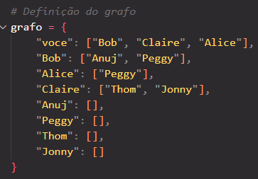
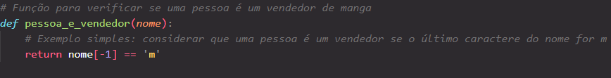
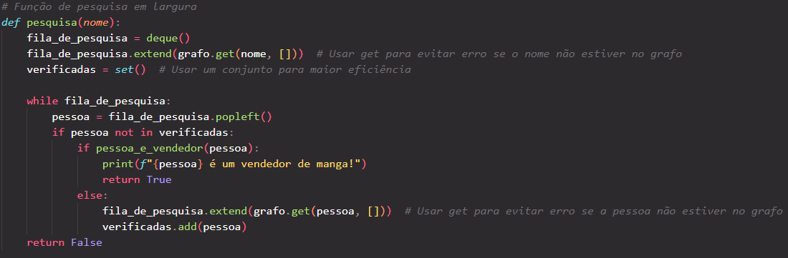

# Busca em Largura para Encontrar um Vendedor de Manga

Este repositório contém um algoritmo de **busca em largura (BFS)** implementado em Python, que percorre um grafo social para encontrar um "vendedor de mangas". O vendedor, neste exemplo, é uma pessoa cujo nome termina com a letra `'m'`. O código simula uma rede de pessoas conectadas e realiza a busca a partir de um ponto inicial.

## Estrutura do Código

### 1. Definição do Grafo

O grafo é representado por um dicionário Python, onde:

- As **chaves** são os nomes das pessoas.
- Os **valores** são listas de outras pessoas que estão diretamente conectadas a elas.

Exemplo:

Aqui, a pessoa "voce" está conectada a "Bob", "Claire", e "Alice", e assim por diante.

### 2. Função para Verificar se Alguém é um Vendedor

A função `pessoa_e_vendedor(nome)` verifica se uma pessoa é considerada um vendedor de manga com base em uma regra simples: se o último caractere do nome for `'m'`, a pessoa é identificada como um vendedor.

### 3. Função de Busca em Largura (BFS)
A função `pesquisa(nome)` implementa a busca em largura para encontrar o vendedor de mangas. A busca começa com a pessoa cujo nome é passado como argumento e, em seguida, percorre as pessoas conectadas, verificando se alguma delas é um vendedor.

- Utiliza uma fila `(deque)` para garantir que as conexões mais próximas sejam verificadas primeiro (característica da busca em largura).
- Usa um conjunto `(set)` para armazenar as pessoas já verificadas, evitando verificações repetidas ou loops infinitos.

Exemplo:

### Como Funciona?

A função `pesquisa("voce")` faz o seguinte:

1. Começa com as pessoas conectadas diretamente a `"voce"`.
2. Verifica cada uma delas (e, em seguida, seus vizinhos) para encontrar alguém cujo nome termine com `'m'`.
3. Se encontrar um vendedor, imprime uma mensagem e retorna `True`. Caso contrário, a busca continua até que todas as conexões sejam verificadas.

### Exemplo de Saída
Se rodarmos a função:
`pesquisa("voce")`
A saída será:
Thom é um vendedor de manga!

### Requisitos
Python 3.x

### Como Executar

1. Clone este repositório:
git clone https://github.com/guizitos/BUSCA-EM-LARGURA.git

2. Navegue até o diretório:
cd BUSCA-EM-LARGURA

3. Execute o arquivo Python:
python3 busca_largura.py

### Expansão

Esse algoritmo pode ser modificado para:

## Outros critérios de seleção de "vendedores" (como verificar diferentes padrões no nome).
## Busca em diferentes tipos de redes (não apenas pessoas).

## Licença

Este projeto está licenciado sob a Licença MIT - consulte o arquivo LICENSE.md para mais detalhes.
